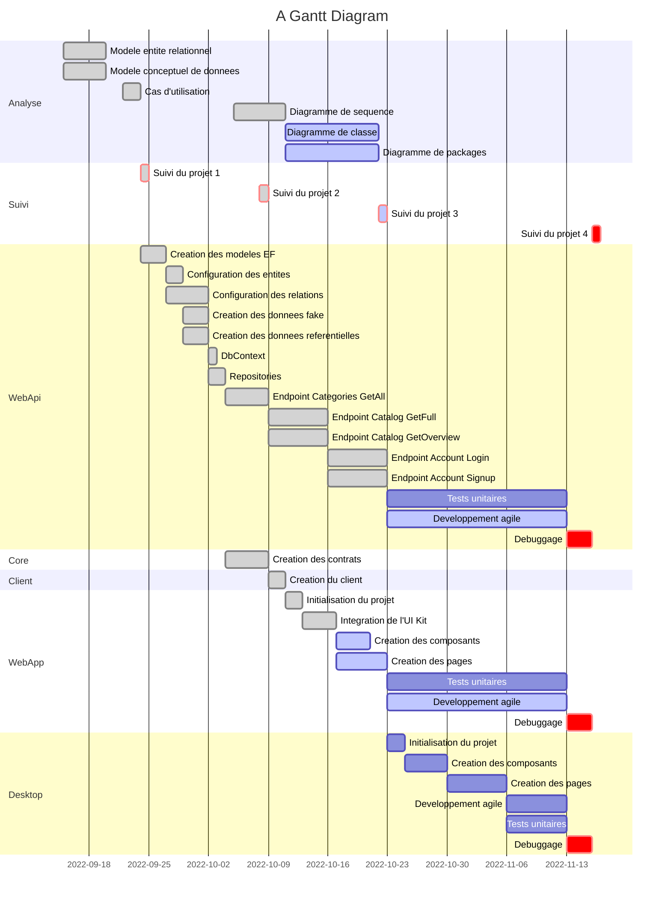
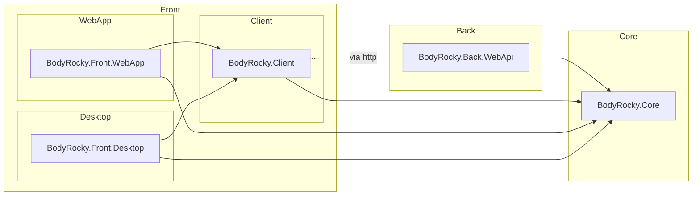
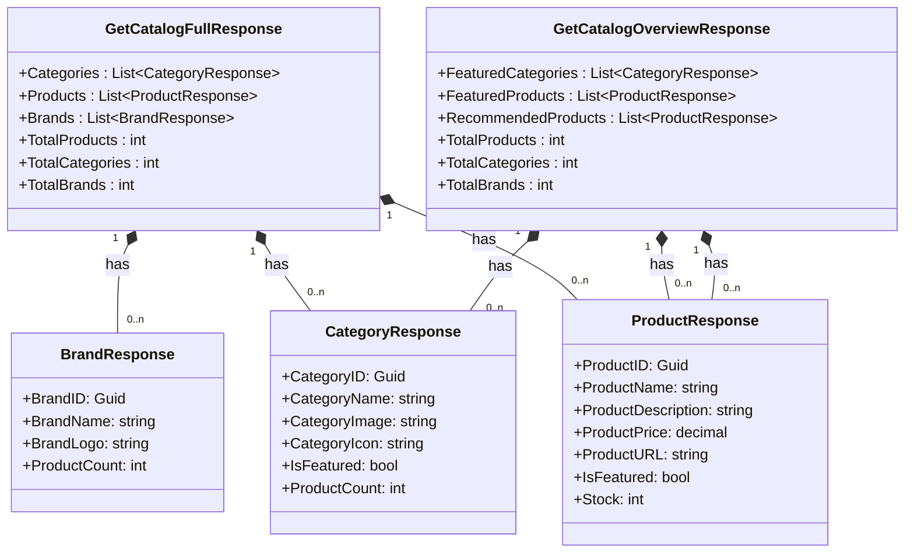
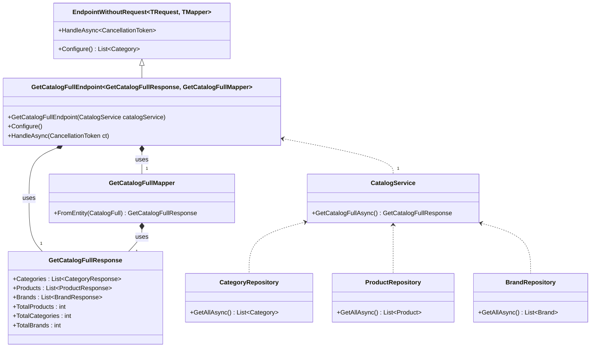

# BodyRocky - eShop d'articles de sport

## Introduction

BodyRocky est un site e-commerce d'articles de sport. Il est développé en .NET 6 avec le framework ASP.NET Core 6.0. Il utilise Entity Framework Core 6.0 pour la gestion de la base de données, fast-endpoints pour la génération des API, et Blazor WebAssembly pour le front-end.

## Architecture de la solution

La solution est composée de 5 projets :

- **BodyRocky.Front.WebApp** : contient l'application web (interface utilisateur)
- **BodyRocky.Front.Desktop** : contient l'application desktop (interface d'administration)
- **BodyRocky.Back.WebApi** : contient les API REST
- **BodyRocky.Client** : contient le client de l'API
- **BodyRocky.Core** : contient les contrats et les modèles exposés par l'API

## Diagramme de gantt du développement des projets (mermaid)

## Diagramme de packages (mermaid)

Les diagrammes de packages sont générés avec [Mermaid](https://mermaid-js.github.io/mermaid/#/).

* Ici, on peut voir que le projet **BodyRocky.Core** est référencé par les projets **BodyRocky.Back.WebApi**, **BodyRocky.Client**, **BodyRocky.Front.WebApp** et **BodyRocky.Front.Desktop**.
* Le projet **BodyRocky.Back.WebApi** n'est pas référencé par le projet **BodyRocky.Client**. C'est le projet **BodyRocky.Client** qui fait appel au projet **BodyRocky.Back.WebApi** via une requête HTTP.
* Le projet **BodyRocky.Client** est référencé par les projets **BodyRocky.Front.WebApp** et **BodyRocky.Front.Desktop**.

## Diagramme de classe BodyRocky.Core (mermaid)

Exemple de diagramme de classe pour les responses de l'API.

Ici, on a une classe `GetCatalogFullResponse` qui contient une liste de `CategoryResponse`, une liste de `ProductResponse` et une liste de `BrandResponse`. On peut voir que la classe `GetCatalogFullResponse` a une relation d'association avec les classes `CategoryResponse`, `ProductResponse` et `BrandResponse`. La relation est de type `1` à `0..n` (un `GetCatalogFullResponse` peut avoir 0 ou plusieurs `CategoryResponse`, `ProductResponse` et `BrandResponse`).

Nous avons aussi une classe `GetCatalogOverviewResponse` qui contient une liste de `CategoryResponse`, une liste de `ProductResponse` et une seconde liste de `ProductResponse`. On peut voir que la classe `GetCatalogOverviewResponse` a une relation d'association avec les classes `CategoryResponse`, `ProductResponse` et `ProductResponse`. La relation est de type `1` à `0..n` (un `GetCatalogOverviewResponse` peut avoir 0 ou plusieurs `CategoryResponse`, `ProductResponse` et `ProductResponse`).

### GetCatalogFullEndpoint

## Analyse du Back-end (API)

### Architecture

Le projet est divisé en 3 couches :

- **DataAccess** : contient les classes de modèles et de contexte de base de données
- **Services** : contient les services de gestion des données
- **Endpoints** : contient les endpoints de l'API

## Analyse du besoin

### Fonctionnalités

- Gestion des utilisateurs
- Gestion des produits
- Gestion des commandes
- Gestion des catégories
- Gestion des marques
- Gestion des avis
- Gestion des promotions
- Gestion des stocks
- Gestion des images
- Gestion des favoris
- Gestion des paniers
- Gestion des adresses
- Gestion des paiements
- Gestion des livraisons
- Gestion des factures
- Gestion des statistiques
- Gestion des notifications

## Services

