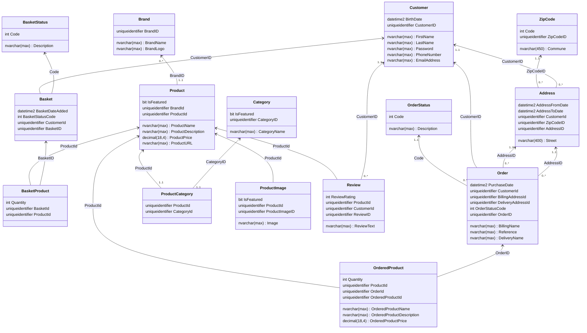

```mermaid
classDiagram
direction BT
class Address {
   datetime2 AddressFromDate
   datetime2 AddressToDate
   nvarchar(400) Street
   uniqueidentifier CustomerId
   uniqueidentifier ZipCodeID
   uniqueidentifier AddressID
}
class Basket {
   datetime2 BasketDateAdded
   int BasketStatusCode
   uniqueidentifier CustomerId
   uniqueidentifier BasketID
}
class BasketProduct {
   int Quantity
   uniqueidentifier BasketId
   uniqueidentifier ProductId
}
class BasketStatus {
   nvarchar(max) Description
   int Code
}
class Brand {
   nvarchar(max) BrandName
   nvarchar(max) BrandLogo
   uniqueidentifier BrandID
}
class Category {
   nvarchar(max) CategoryName
   bit IsFeatured
   uniqueidentifier CategoryID
}
class Customer {
   nvarchar(max) FirstName
   nvarchar(max) LastName
   datetime2 BirthDate
   nvarchar(max) Password
   nvarchar(max) PhoneNumber
   nvarchar(max) EmailAddress
   uniqueidentifier CustomerID
}
class Order {
   nvarchar(max) BillingName
   nvarchar(max) Reference
   nvarchar(max) DeliveryName
   datetime2 PurchaseDate
   uniqueidentifier CustomerId
   uniqueidentifier BillingAddressId
   uniqueidentifier DeliveryAddressId
   int OrderStatusCode
   uniqueidentifier OrderID
}
class OrderStatus {
   nvarchar(max) Description
   int Code
}
class OrderedProduct {
   nvarchar(max) OrderedProductName
   nvarchar(max) OrderedProductDescription
   decimal(18,4) OrderedProductPrice
   int Quantity
   uniqueidentifier ProductId
   uniqueidentifier OrderId
   uniqueidentifier OrderedProductId
}
class Product {
   nvarchar(max) ProductName
   nvarchar(max) ProductDescription
   decimal(18,4) ProductPrice
   nvarchar(max) ProductURL
   bit IsFeatured
   uniqueidentifier BrandId
   uniqueidentifier ProductId
}
class ProductCategory {
   uniqueidentifier ProductId
   uniqueidentifier CategoryId
}
class ProductImage {
   nvarchar(max) Image
   bit IsFeatured
   uniqueidentifier ProductId
   uniqueidentifier ProductImageID
}
class Review {
   int ReviewRating
   nvarchar(max) ReviewText
   uniqueidentifier ProductId
   uniqueidentifier CustomerId
   uniqueidentifier ReviewID
}
class ZipCode {
   int Code
   nvarchar(450) Commune
   uniqueidentifier ZipCodeID
}

Address "0..*" --> "1..1" Customer : CustomerID
Address "0..*" --> "1..1" ZipCode : ZipCodeID
Basket  -->  BasketStatus : Code
Basket  -->  Customer : CustomerID
BasketProduct  -->  Basket : BasketID
BasketProduct  -->  Product : ProductId
Order "0..*" --> "1..1"  Address : AddressID
Order "0..*" --> "1..1"  Address : AddressID
Order  -->  Customer : CustomerID
Order "0..*" --> "1..1" OrderStatus : Code
OrderedProduct  -->  Order : OrderID
OrderedProduct  -->  Product : ProductId
Product "1..1" --> "0..*"  Brand : BrandID
ProductCategory "1..1" --> Category : CategoryID
ProductCategory "1..1" -->  Product : ProductId
ProductImage  -->  Product : ProductId
Review "0..*" --> "1..1"  Customer : CustomerID
Review  -->  Product : ProductId
```